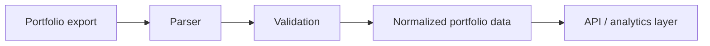

# AI Portfolio Assistant

[](https://www.python.org/)
[](LICENSE)
[](https://fastapi.tiangolo.com/)
[](https://pytest.org/)

A modern Python-based portfolio assistant for ingesting, validating, and analyzing portfolio data with a clean and extensible architecture. The project is designed as a practical example of production-oriented Python development using FastAPI, Pydantic, and a structured service-based design.

## Overview

This repository demonstrates a professional approach to building a portfolio processing system with:

- clear separation between domain models, services, and API layers
- strong validation using Pydantic
- parser-based ingestion for financial export formats
- an architecture that can evolve into richer analytics and AI-assisted features

## Features

- Asynchronous ingestion flow with non-blocking parsing support
- DEGIRO portfolio parser for localized CSV exports
- Privacy-conscious portfolio normalization for safe sharing and presentation
- FastAPI-based application structure
- Strong data validation and configuration management with Pydantic
- Modern Python tooling with uv, Ruff, pytest, and mypy

## How It Works



## Project Structure

```text
.
├── src/
│   └── portfolio_assistant/
│       ├── api/
│       ├── models/
│       ├── services/
│       ├── config.py
│       └── main.py
├── tests/
├── pyproject.toml
├── Makefile
└── README.md
```

## Getting Started

### Prerequisites

- Python 3.11 or newer
- uv

### Installation

```bash
git clone https://github.com/your-username/ai-portfolio-assistant.git
cd ai-portfolio-assistant
make install
```

### Environment Setup

```bash
cp .env.example .env
```

## Development

### Run tests

```bash
make test
```

### Lint and type-check

```bash
make lint
make typecheck
```

### Useful commands

```bash
uv run pytest
uv run ruff check . --fix
uv run ruff format .
uv run mypy src
```

## Architecture

The project follows a service-oriented structure that separates concerns into distinct layers:

- Domain models live under the models package and enforce business rules through validation
- Services encapsulate parsing and integration logic
- The API layer is kept thin and focused on request handling and response formatting

This makes the codebase easier to extend as new parsers, data sources, or advisory features are added.

## Roadmap

- Domain models and parsing pipeline
- Expand coverage for additional portfolio formats
- Add market data and valuation features
- Introduce AI-assisted insights and reporting

## License

This project is licensed under the MIT License. See the LICENSE file for details.
